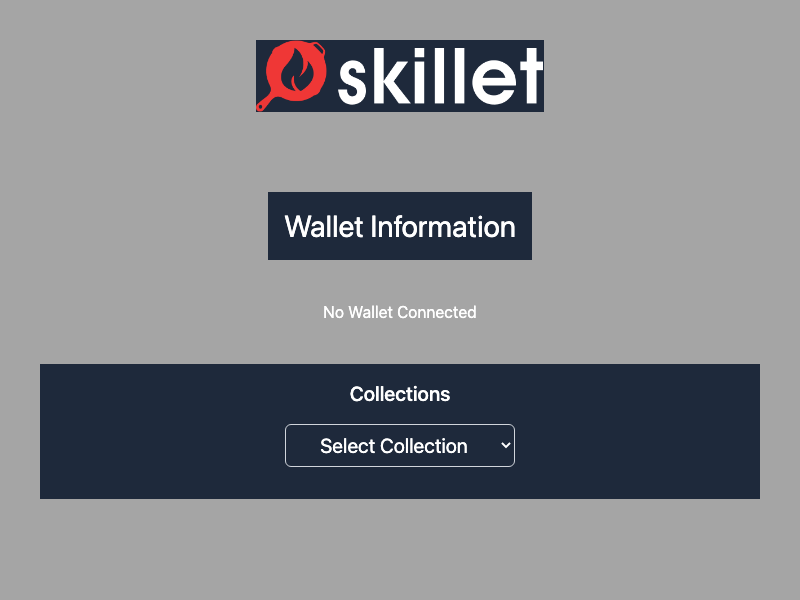

# coding-challenge

## Description

This is a React app that fetches data from REST API endpoints and displays NFT data as React components to a user.



## Tech Stack

The app is built using the following technologies:

- React 18
- Vite
- Typescript
- Tailwind CSS
- Axios
- Marked
- ESLint

## Quick Start

To get started with the project, follow these steps:

1. Run `npm install` to install the project dependencies.

1. Create a `.env` file and add the following environment variables to the file:

```
VITE_ETHERSCAN_KEY=YOUR_ETHERSCAN_KEY
VITE_WALLETCONNECT_PROJECT_ID=YOUR_WALLETCONNECT_PROJECT_ID
```

3. Run `npm run dev` to start the development server.
