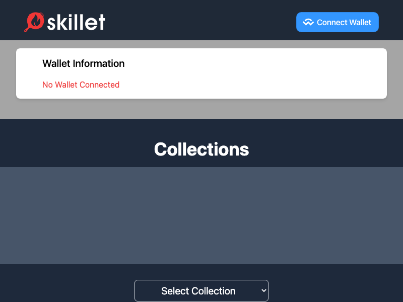

# coding-challenge

## Description



React App that fetches data from the REST API endpoints listed below and displays the following NFT data as React components to a user

## Tech

- React 18
- Vite
- Typescript
- Tailwind CSS
- Axios
- Marked
- ESLint

## Quick Start

1. `npm install`

2. `touch .env` and add the following to the file

```
VITE_ETHERSCAN_KEY=YOUR_ETHERSCAN_KEY
VITE_WALLETCONNECT_PROJECT_ID=YOUR_WALLETCONNECT_PROJECT_ID
```

3. `npm run dev`
